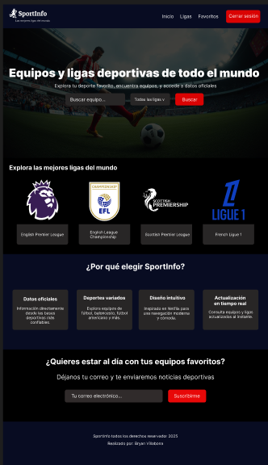
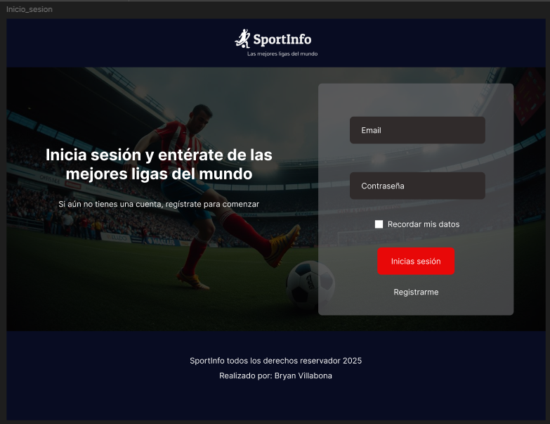
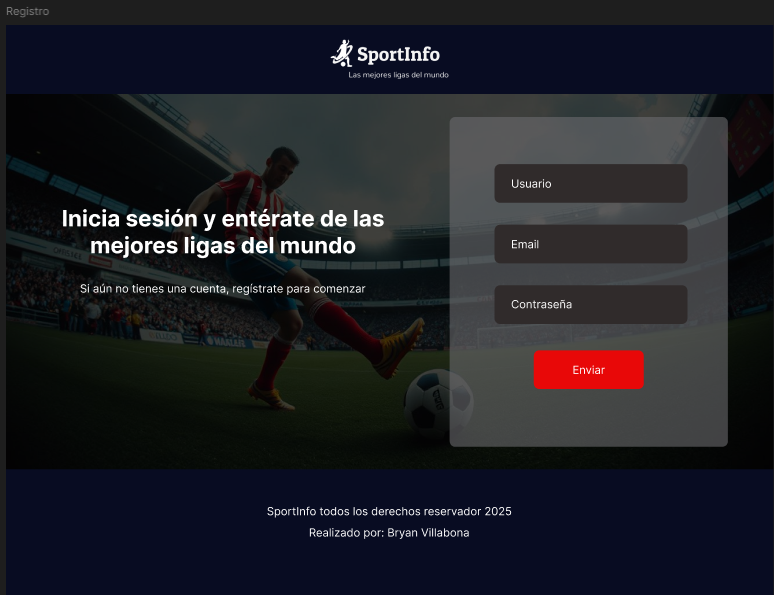

# SportInfo 

Una aplicación web moderna para explorar equipos y ligas de fútbol de todo el mundo, con una interfaz intuitiva estilo Netflix que permite buscar, filtrar y gestionar equipos favoritos.

## Características

- **Exploración de Ligas**: Visualiza las principales ligas de fútbol del mundo
- **Búsqueda de Equipos**: Busca equipos específicos por nombre
- **Filtros por Liga**: Filtra equipos por liga específica
- **Sistema de Favoritos**: Guarda hasta 6 equipos favoritos
- **Información Detallada**: Consulta información completa de equipos y ligas
- **Diseño Responsive**: Optimizado para dispositivos móviles y desktop
- **Interfaz Moderna**: Diseño tipo Netflix con carrusel interactivo

## Tecnologías Utilizadas

- **Frontend**: HTML5, CSS3, JavaScript ES6+
- **Framework CSS**: Tailwind CSS
- **API**: TheSportsDB API
- **Almacenamiento**: LocalStorage para favoritos
- **Diseño**: Figma (prototipado)

## Capturas de Pantalla

### Diseño en Figma




**🔗 Link de Figma**: [Ver diseño completo en Figma](https://www.figma.com/design/MwebXFugFeIHOr684IhRk2/Maquetaci%C3%B3n-Sportinfo?m=auto&t=MlAfksHTgrQmaoLv-7)

## Instalación y Uso

### Prerrequisitos
- Navegador web moderno (preferiblemente Chrome)
- Conexión a internet (para API)

### Instalación
1. Clona este repositorio:
```bash
git clone https://github.com/tu-usuario/sportinfo.git
```

2. Navega al directorio del proyecto:
```bash
cd sportinfo
```

3. Abre `index.html` en tu navegador web favorito

### Estructura del Proyecto
```
sportinfo/
├── index.html              # Página de inicio de sesión
├── html/
│   ├── inicio.html         # Página principal de la aplicación
│   └── registro.html       # Página de registro
├── css/
│   └── estilos.css        # Estilos personalizados
├── js/
│   └── main.js            # Lógica principal de la aplicación
├── img/
│   ├── color_transparent.png  # Logo de la aplicación
│   ├── futbol.jpg            # Imagen de fondo
└── README.md
```

## Funcionalidades Principales

### 1. Autenticación
- Formulario de inicio de sesión
- Formulario de registro de usuarios
- Navegación fluida entre páginas

### 2. Exploración de Contenido
- **Carrusel de Ligas**: Visualiza las principales ligas de fútbol
- **Búsqueda Inteligente**: Busca equipos por nombre
- **Filtros Avanzados**: Filtra por liga específica
- **Navegación Intuitiva**: Controles de carrusel con desplazamiento automático

### 3. Gestión de Favoritos
- Agregar/quitar equipos de favoritos
- Límite de 6 equipos favoritos
- Persistencia de datos en LocalStorage
- Vista dedicada para favoritos

### 4. Información Detallada
- Modal con información completa del equipo
- Datos como: estadio, año de fundación, país, liga
- Descripción detallada del equipo
- Logo oficial del equipo

## API Utilizada

Este proyecto utiliza la [TheSportsDB API](https://www.thesportsdb.com/documentation) para obtener:

- Información de ligas de fútbol
- Datos de equipos
- Logos oficiales
- Estadísticas y detalles

### Endpoints Principales:
- `/api/v1/json/3/all_leagues.php` - Todas las ligas
- `/api/v1/json/3/searchteams.php` - Búsqueda de equipos
- `/api/v1/json/123/search_all_teams.php` - Equipos por liga
- `/api/v1/json/123/lookupleague.php` - Detalles de liga

## Características de Diseño

- **Tema Oscuro**: Colores predominantes negro y gris
- **Acentos Rojos**: Botones y elementos interactivos
- **Tipografía Moderna**: Fuentes legibles y jerárquicas
- **Animaciones Suaves**: Transiciones y efectos hover
- **Responsive Design**: Adaptable a diferentes tamaños de pantalla

## Configuración

### Variables Principales (main2.js)
```javascript
const API_CONFIG = {
    BASE_URL: "https://www.thesportsdb.com/api/v1/json",
    // Endpoints de la API
};

const DEFAULTS = {
    MAX_FAVORITES: 6,           // Máximo de favoritos
    SCROLL_AMOUNT: 300,         // Velocidad de scroll
    AUTO_SCROLL_INTERVAL: 6000  // Intervalo de auto-scroll
};
```

## Funcionalidades Técnicas

### Gestión de Estado
- **LocalStorage**: Persistencia de favoritos
- **Gestión de Errores**: Manejo robusto de errores de API
- **Carga Asíncrona**: Peticiones no bloqueantes

### Arquitectura del Código
- **Patrón MVC**: Separación de responsabilidades
- **Clases ES6**: Organización modular del código
- **Async/Await**: Manejo moderno de asincronía
- **Event Delegation**: Gestión eficiente de eventos

## Mejoras Futuras

- [ ] Implementar autenticación real con backend
- [ ] Agregar más deportes además del fútbol
- [ ] Sistema de notificaciones
- [ ] Modo claro/oscuro
- [ ] Compartir equipos favoritos
- [ ] Estadísticas de equipos
- [ ] Calendario de partidos

## Contribuciones

Las contribuciones son bienvenidas. Para contribuir:

1. Fork del proyecto
2. Crea una rama para tu feature (`git checkout -b feature/AmazingFeature`)
3. Commit tus cambios (`git commit -m 'Add some AmazingFeature'`)
4. Push a la rama (`git push origin feature/AmazingFeature`)
5. Abre un Pull Request

## Licencia

Este proyecto está bajo la Licencia MIT - ver el archivo [LICENSE.md](LICENSE.md) para detalles.

## Autor

**Bryan Villabona**
- Diseñador y Desarrollador Frontend
- Proyecto académico/personal

## Agradecimientos

- [TheSportsDB](https://www.thesportsdb.com/) por proporcionar la API gratuita
- [Tailwind CSS](https://tailwindcss.com/) por el framework de estilos
- Comunidad de desarrolladores por inspiración y recursos

---